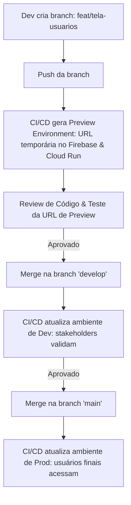

# Plano de Arquitetura de Nuvem e CI/CD: Cloud Run + Firebase + Cloud SQL

Este documento apresenta a estratégia completa de implantação e entrega contínua (CI/CD) para o projeto **Normatiza v2**, dividida entre **Produção**, **Desenvolvimento** e **Ambientes de Preview/Teste por Branch**.

---

## 🎛️ 1. Arquitetura de Ambientes

Para otimizar custos mantendo o isolamento, utilizaremos a flexibilidade do Firebase Hosting e do Google Cloud Run.

### Banco de Dados (Cloud SQL - MySQL)
Para otimizar os créditos do Google Cloud, usaremos **uma única instância física do Cloud SQL**, mas dividida logicamente:
*   `normatiza_prod`: Banco oficial consumido pela API de Produção.
*   `normatiza_dev`: Banco de testes consumido pela API de Desenvolvimento.
*   `normatiza_preview`: Banco de testes efêmeros consumido pelas branches de feature.

### Backend (Google Cloud Run)
Hospedaremos as APIs em contêineres Docker independentes no Cloud Run:
*   `api-prod`: Aponta para a branch `main` e banco `normatiza_prod`.
*   `api-dev`: Aponta para a branch `develop` e banco `normatiza_dev`.
*   `api-preview-[pr-number]`: Criado dinamicamente para PRs abertos.

### Frontends (Firebase Hosting)
O Firebase gerencia domínios e certificados de forma automática:
*   **Web (Admin)**:
    *   Produção (`main`): `admin.normatiza.com` ou `normatiza-admin.web.app` (Canal `live`).
    *   Desenvolvimento (`develop`): `dev-admin.normatiza.com` ou `normatiza-admin-dev.web.app` (Canal `live` de outro site Firebase).
    *   Preview (Branch/PR): URL única gerada temporariamente pelo Firebase (ex: `normatiza-admin--pr12-feat-xxxx.web.app`).
*   **Mobile (PWA)**:
    *   Produção (`main`): `app.normatiza.com` ou `normatiza-app.web.app`.
    *   Desenvolvimento (`develop`): `dev-app.normatiza.com` ou `normatiza-app-dev.web.app`.
    *   Preview (Branch/PR): URL temporária gerada pelo Firebase.

---

## 🔄 2. Fluxo do Desenvolvedor (Git Flow)



---

## 🔧 3. Estrutura de CI/CD (GitHub Actions)

Criaremos três arquivos de workflows sob a pasta `.github/workflows/`:

### A. Preview / Testes por Branch (`preview.yml`)
*   **Gatilho**: Abertura ou atualização de Pull Request para a branch `develop`.
*   **Ações**:
    1.  Compila e sobe um contêiner temporário da API para o Cloud Run (com tags de identificação do PR).
    2.  Compila os Frontends (`web` e `mobile`) injetando o endereço da API temporária.
    3.  Publica os fronts nos **canais de preview** do Firebase Hosting.
    4.  Escreve um comentário automático no PR com as URLs geradas para testes antes do merge.

### B. Desenvolvimento (`develop.yml`)
*   **Gatilho**: Push/Merge na branch `develop`.
*   **Ações**:
    1.  Autentica no GCP via Service Account.
    2.  Builda a imagem Docker da API (`apps/api`), envia para o **Google Artifact Registry** e atualiza o serviço `api-dev` no Cloud Run.
    3.  Roda as migrações automáticas de banco via Prisma: `prisma db push` ou `prisma migrate deploy` direcionadas ao banco `normatiza_dev`.
    4.  Builda e publica o Front Web e o Mobile PWA no site de desenvolvimento do Firebase Hosting.

### C. Produção (`production.yml`)
*   **Gatilho**: Push/Merge na branch `main`.
*   **Ações**:
    1.  Executa o build de produção da API, envia para o Artifact Registry e atualiza o serviço `api-prod` no Cloud Run.
    2.  Aplica as migrações pendentes de banco no `normatiza_prod`.
    3.  Builda e publica o Front Web e o Mobile PWA nos domínios principais de produção no Firebase Hosting.

---

## 📑 4. Passo a Passo da Configuração no Google Cloud

### Passo 1: Conta de Serviço (IAM)
Crie uma conta de serviço no painel do GCP chamada `github-actions-deployer` com as seguintes permissões:
*   `Administrador do Cloud Run` (para gerenciar os deploys).
*   `Usuário da conta de serviço` (para o Cloud Run poder rodar a imagem).
*   `Gravador do Artifact Registry` (para enviar as imagens Docker).
*   `Cliente do Cloud SQL` (para conectar a API e rodar as migrações).

### Passo 2: Google Artifact Registry
Crie um repositório Docker no painel do GCP:
*   Nome: `normatiza-repo`
*   Formato: Docker

### Passo 3: Banco de Dados no Cloud SQL
1.  Crie a instância MySQL.
2.  Crie os bancos lógicos `normatiza_prod`, `normatiza_dev` e `normatiza_preview` na aba "Bancos de dados".
3.  Configure o acesso para conexões seguras usando o **Cloud SQL Auth Proxy** (nativo nos contêineres do Cloud Run).

### Passo 4: Segredos no GitHub (Repository Secrets)
Adicione as credenciais confidenciais no repositório do GitHub em *Settings > Secrets and variables > Actions*:
*   `GCP_SA_KEY`: JSON gerado da Conta de Serviço criada no Passo 1.
*   `GCP_PROJECT_ID`: ID do seu projeto no GCP.
*   `FIREBASE_SERVICE_ACCOUNT`: Token/Credencial do Firebase para deploy do hosting.
*   `DATABASE_URL_DEV`: String de conexão MySQL para desenvolvimento.
*   `DATABASE_URL_PROD`: String de conexão MySQL para produção.

---

## 🐳 5. Configuração da API para Cloud Run (Dockerfile)

Como o Cloud Run hospeda contêineres, criamos um `Dockerfile` na raiz da pasta `apps/api/` que utiliza a compilação via Webpack que configuramos:

```dockerfile
# Estágio de Dependências
FROM node:20-alpine AS deps
WORKDIR /usr/src/app
RUN npm install -g pnpm
COPY package.json pnpm-workspace.yaml pnpm-lock.yaml ./
COPY apps/api/package.json ./apps/api/
COPY packages/shared/package.json ./packages/shared/
RUN pnpm install --frozen-lockfile

# Estágio de Compilação
FROM node:20-alpine AS builder
WORKDIR /usr/src/app
RUN npm install -g pnpm
COPY --from=deps /usr/src/app/node_modules ./node_modules
COPY --from=deps /usr/src/app/apps/api/node_modules ./apps/api/node_modules
COPY . .
RUN pnpm --filter api build

# Estágio de Execução
FROM node:20-alpine AS runner
WORKDIR /usr/src/app
ENV NODE_ENV=production
COPY package.json ./
RUN npm install -g pnpm && pnpm install --prod --ignore-scripts
COPY --from=builder /usr/src/app/apps/api/dist ./apps/api/dist
COPY --from=builder /usr/src/app/apps/api/prisma ./apps/api/prisma

EXPOSE 3000
CMD [ "node", "apps/api/dist/main.js" ]
```

> [!TIP]
> **Dica de Custos**: No Cloud Run da API de Desenvolvimento, configure a opção `Min-instances = 0`. Dessa forma, o Google desliga a API de Dev quando ninguém a estiver testando (durante a noite e finais de semana), zerando a cobrança de processamento e economizando seus créditos da nuvem.
