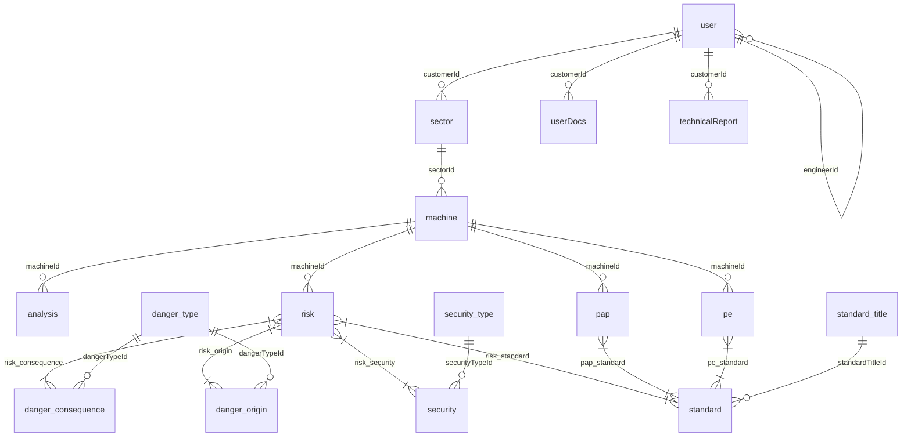

# 02 - Dicionário e Modelagem do Banco de Dados (Database Schema)

Este documento detalha a estrutura do banco de dados relacional utilizado pelo sistema **Normatiza**, mapeando tabelas, colunas, tipos de dados, chaves primárias e estrangeiras, índices e a finalidade de cada entidade no ecossistema de conformidade com a NR-12.

---

## 1. Visão Geral e Relacionamento de Entidades

O banco de dados é modelado para suportar uma estrutura multi-tenant lógica, na qual a tabela `user` centraliza tanto os operadores quanto os clientes, e as relações associativas determinam o isolamento de dados.

### Diagrama de Relacionamento Simplificado (Mermaid)

---

## 2. Dicionário de Tabelas

Abaixo estão descritas detalhadamente todas as tabelas do banco de dados, seus atributos, tipos nativos e comportamentos esperados na migração.

### 2.1 Tabela `user`
Armazena todos os tipos de usuários da plataforma (administradores, engenheiros, analistas, clientes finais, gerentes e parceiros).

| Coluna | Tipo SQL | Chave | Nula? | Descrição / Regra |
| :--- | :--- | :---: | :---: | :--- |
| `id` | `int(11)` | PK | Não | Identificador único incremental do usuário. |
| `name` | `varchar(255)` | - | Não | Nome completo ou Razão Social do usuário. |
| `businessName` | `varchar(255)` | - | Sim | Nome Fantasia (para perfis corporativos). |
| `cpfCnpj` | `varchar(14)` | - | Sim | CPF (11 dígitos) ou CNPJ (14 dígitos) sem formatação. |
| `email` | `varchar(255)` | UQ | Não | E-mail do usuário (utilizado para login). |
| `telephone` | `varchar(10)` | - | Sim | Telefone fixo (DDD + número). |
| `cellphone` | `varchar(11)` | - | Sim | Telefone celular (DDD + 9 + número). |
| `streetName` | `varchar(255)` | - | Sim | Nome do logradouro. |
| `streetNumber` | `varchar(30)` | - | Sim | Número do endereço. |
| `postalCode` | `varchar(8)` | - | Sim | CEP sem hífen. |
| `district` | `varchar(30)` | - | Sim | Bairro. |
| `complement` | `varchar(150)` | - | Sim | Complemento do endereço. |
| `city` | `varchar(255)` | - | Sim | Cidade. |
| `state` | `varchar(2)` | - | Sim | Sigla do Estado (UF). |
| `responsible` | `varchar(255)` | - | Sim | Nome da pessoa física responsável (para clientes PJ). |
| `customerCode` | `varchar(80)` | - | Sim | Código interno de identificação do cliente. |
| `proRegisterType` | `varchar(255)` | - | Sim | Tipo de registro profissional (ex: CREA, CFT). |
| `proRegisterNumber` | `varchar(255)` | - | Sim | Número de registro profissional do inspetor. |
| `role` | `varchar(255)` | - | Sim | Cargo / Função descritiva do usuário. |
| `type` | `int(11)` | - | Não | Enum `UserType` (1=Admin, 2=Engineer, 3=Analyst, etc.). |
| `maxAnalysis` | `int(11)` | - | Não | Saldo de análises permitidas (0 = ilimitado). |
| `password` | `binary(128)` | - | Não | Hash binário SHA-256 da senha. |
| `salt` | `binary(128)` | - | Não | Sal binário de 32 bytes gerado na criação. |
| `engineerId` | `int(11)` | FK | Sim | Auto-relacionamento indicando o engenheiro dono/criador. |
| `photoId` | `int(11)` | FK | Sim | Link com a foto de perfil do usuário. |
| `disabledAt` | `datetime` | - | Sim | Data de exclusão lógica (soft-delete). |
| `useDocx` | `bit` | - | Não | Flag que habilita geração de laudos em Word. |
| `canDeleteAnalisys`| `bit` | - | Não | Permissão para exclusão de análises de risco. |
| `emailConfirmed` | `bit` | - | Não | Flag indicando se o e-mail do usuário foi validado. |
| `enabled` | `bit` | - | Não | Flag indicando se a conta está ativa para login. |
| `isTrialUser` | `bit` | - | Não | Flag indicando se é uma conta de teste (Trial). |
| `reportType` | `int(11)` | - | Não | Configuração estética do layout de laudo a ser gerado. |
| `avaliableTrialAnalisys`| `int` | - | Não | Saldo de análises restantes no Trial. |
| `avaliableTrialDays`| `int` | - | Não | Quantidade de dias de teste atribuída (padrão 14). |
| `createdAt` | `datetime` | - | Sim | Data de criação do registro de usuário. |
| `expiredAt` | `datetime` | - | Sim | Data exata de expiração do plano Trial. |

---

### 2.2 Tabela `machine`
Contém as máquinas e equipamentos vistoriados cadastrados no inventário dos clientes.

| Coluna | Tipo SQL | Chave | Nula? | Descrição |
| :--- | :--- | :---: | :---: | :--- |
| `id` | `int(11)` | PK | Não | Código de identificação da máquina. |
| `equipmentName` | `varchar(255)` | - | Sim | Nome descritivo da máquina. |
| `equipmentModel` | `varchar(255)` | - | Sim | Modelo do equipamento. |
| `equipmentType` | `varchar(255)` | - | Sim | Categoria/tipo de equipamento. |
| `manufacturer` | `varchar(255)` | - | Sim | Nome da fabricante da máquina. |
| `manufactureYear` | `int(11)` | - | Sim | Ano de fabricação. |
| `serialNumber` | `varchar(255)` | - | Sim | Número de série física da máquina. |
| `manufacturerTag` | `varchar(255)` | - | Sim | Tag de identificação interna. |
| `manufacturerPatrimony`| `varchar(255)`| - | Sim | Número de patrimônio do cliente. |
| `manufacturerCnpj` | `varchar(14)` | - | Sim | CNPJ da fabricante. |
| `manufacturerCrea` | `varchar(255)` | - | Sim | CREA da fabricante. |
| `manufacturerAddress` | `varchar(255)` | - | Sim | Endereço da fabricante. |
| `manufacturerCity` | `varchar(255)` | - | Sim | Cidade da fabricante. |
| `manufacturerPostalCode`| `varchar(8)`| - | Sim | CEP da fabricante. |
| `height` | `varchar(255)` | - | Sim | Altura física da máquina. |
| `width` | `varchar(255)` | - | Sim | Largura física da máquina. |
| `depth` | `varchar(255)` | - | Sim | Profundidade física da máquina. |
| `weight` | `varchar(255)` | - | Sim | Peso da máquina. |
| `productiveCapacity` | `varchar(255)` | - | Sim | Capacidade produtiva declarada. |
| `capacity` | `varchar(255)` | - | Sim | Capacidade geral / potência. |
| `cycleTime` | `varchar(255)` | - | Sim | Tempo de ciclo de operação. |
| `driveTime` | `varchar(255)` | - | Sim | Tempo de acionamento. |
| `emergencyTime` | `varchar(255)` | - | Sim | Tempo de parada de emergência. |
| `commandPositions` | `varchar(255)` | - | Sim | Postos de comando existentes. |
| `totalOperators` | `int(11)` | - | Sim | Quantidade de operadores expostos. |
| `machineUsage` | `varchar(255)` | - | Sim | Regime de uso diário/semanal. |
| `eletricEnergy` | `bit` | - | Sim | Possui fonte de energia elétrica? |
| `pneumaticEnergy` | `bit` | - | Sim | Possui fonte de energia pneumática? |
| `hydraulicEnergy` | `bit` | - | Sim | Possui fonte de energia hidráulica? |
| `mechanicalEnergy` | `bit` | - | Sim | Possui fonte de energia mecânica? |
| `radioactiveEnergy` | `bit` | - | Sim | Possui fonte de energia radioativa? |
| `capitation` | `bit` | - | Sim | Possui captação de resíduos/gases? |
| `hasInstructionManual`| `bit` | - | Sim | Possui manual de instruções em português? |
| `workingAndSafetyProcedures`| `bit` | - | Sim | Possui procedimentos de trabalho e segurança? |
| `registeredPreventiveMaintenance`| `bit`| - | Sim | Possui manutenções registradas em livro próprio? |
| `intendedPreventiveMaintenance`| `bit`| - | Sim | Possui plano de manutenção preventiva previsto? |
| `maintenanceRecordAvailable`| `bit`| - | Sim | O registro de manutenções está disponível? |
| `processDescription` | `text` | - | Sim | Descrição detalhada do processo de trabalho. |
| `operatorInterventions`| `varchar(255)`| - | Sim | Intervenções comuns do operador (ex: setup). |
| `otherInfo` | `text` | - | Sim | Outras informações e observações técnicas relevantes. |
| `sectorId` | `int(11)` | FK | Não | Setor físico ao qual a máquina pertence. |
| `frontPhotoId` | `int(11)` | FK | Sim | Foto da vista frontal da máquina. |
| `leftPhotoId` | `int(11)` | FK | Sim | Foto da vista lateral esquerda da máquina. |
| `rightPhotoId` | `int(11)` | FK | Sim | Foto da vista lateral direita da máquina. |
| `topPhotoId` | `int(11)` | FK | Sim | Foto da vista superior da máquina. |
| `createdAt` | `datetime` | - | Sim | Data de cadastro da máquina no inventário. |

---

### 2.3 Tabela `analysis`
Representa um laudo/análise técnica executada em uma determinada máquina.

| Coluna | Tipo SQL | Chave | Nula? | Descrição |
| :--- | :--- | :---: | :---: | :--- |
| `id` | `int(11)` | PK | Não | Código único da análise. |
| `sequential` | `int(11)` | - | Não | Número sequencial gerado para o cliente. |
| `creatorId` | `int(11)` | FK | Não | ID do usuário que criou o registro. |
| `customerId` | `int(11)` | FK | Não | ID do cliente vistoriado. |
| `analystId` | `int(11)` | FK | Sim | ID do analista responsável (se houver). |
| `engineerId` | `int(11)` | FK | Sim | ID do engenheiro supervisor/responsável. |
| `machineId` | `int(11)` | FK | Não | ID da máquina analisada. |
| `projectArt` | `varchar(255)` | - | Sim | Número da ART (Anotação de Responsabilidade Técnica). |
| `completed` | `bit` | - | Não | Flag indicando se a análise foi finalizada. |
| `createdAt` | `datetime` | - | Sim | Data de início da análise. |
| `completedAt` | `datetime` | - | Sim | Data de conclusão da análise. |
| `createdDevice` | `int(1)` | - | Sim | Flag indicando se foi criada via mobile ou web. |

---

### 2.4 Tabela `risk`
Cadastra cada perigo e risco identificado na máquina sob análise.

| Coluna | Tipo SQL | Chave | Nula? | Descrição |
| :--- | :--- | :---: | :---: | :--- |
| `id` | `int(11)` | PK | Não | Identificador único do risco. |
| `sequencial` | `int(11)` | - | Não | Sequencial do risco no contexto da máquina. |
| `local` | `varchar(255)` | - | Sim | Localização física do perigo na máquina. |
| `severityCategory` | `int(11)` | - | Sim | Fator de Severidade (Fórmula HRN). |
| `frequencyCategory` | `int(11)` | - | Sim | Fator de Frequência de exposição (Fórmula HRN). |
| `possibilityCategory` | `int(11)` | - | Sim | Fator de Probabilidade do dano (Fórmula HRN). |
| `hrnNp` | `int(11)` | - | Sim | Fator de Número de pessoas expostas (Fórmula HRN). |
| `hrnFe` | `decimal(10,2)`| - | Sim | Resultado intermediário HRN. |
| `hrnPe` | `decimal(10,2)`| - | Sim | Resultado intermediário HRN. |
| `hrnMpl` | `decimal(10,2)`| - | Sim | Resultado final HRN quantificado. |
| `useCategory` | `bit` | - | Sim | Flag de categorização de uso. |
| `solution` | `text` | - | Sim | Solução ou medida de mitigação sugerida. |
| `photoId` | `int(11)` | FK | Sim | Foto ilustrativa do ponto de perigo. |
| `machineId` | `int(11)` | FK | Não | ID da máquina vinculada. |
| `createdAt` | `datetime` | - | Sim | Data de identificação do risco. |

---

### 2.5 Tabelas de Estrutura de Perigos e Proteção
Estas tabelas contêm a árvore de cadastros globais do sistema de perigos e soluções.

#### `danger_type` (Tipos de Perigo)
Ex: Mecânico, Elétrico, Térmico, Ergonômico.
*   `id` `int(11)` PK
*   `name` `varchar(255)` Não nulo

#### `danger_origin` (Origem do Perigo)
Ex: Partes móveis expostas, Superfícies quentes.
*   `id` `int(11)` PK
*   `name` `varchar(255)` Não nulo
*   `dangerTypeId` `int(11)` FK -> `danger_type.id`

#### `danger_consequence` (Consequência do Perigo)
Ex: Esmagamento, Queimadura, Amputação.
*   `id` `int(11)` PK
*   `name` `varchar(255)` Não nulo
*   `dangerTypeId` `int(11)` FK -> `danger_type.id`

#### `security_type` (Tipos de Proteção/Medida)
Ex: Proteção Fixa, Proteção Móvel Intertravada, Barreira Óptica.
*   `id` `int(11)` PK
*   `name` `varchar(255)` Não nulo

#### `security` (Proteção/Medida Específica)
*   `id` `int(11)` PK
*   `name` `varchar(255)` Não nulo
*   `securityTypeId` `int(11)` FK -> `security_type.id`

---

### 2.6 Tabelas Associativas de Riscos (Relacionamentos Muitos-para-Muitos)

#### `risk_consequence` (Associa riscos encontrados às consequências de perigo)
*   `riskId` `int(11)` PK, FK -> `risk.id`
*   `dangerConsequenceId` `int(11)` PK, FK -> `danger_consequence.id`

#### `risk_origin` (Associa riscos encontrados às origens de perigo)
*   `riskId` `int(11)` PK, FK -> `risk.id`
*   `dangerOriginId` `int(11)` PK, FK -> `danger_origin.id`

#### `risk_security` (Associa riscos às medidas de proteção instaladas/propostas)
*   `riskId` `int(11)` PK, FK -> `risk.id`
*   `securityId` `int(11)` PK, FK -> `security.id`

#### `risk_standard` (Associa riscos específicos aos artigos das Normas Regulamentadoras descumpridos)
*   `riskId` `int(11)` PK, FK -> `risk.id`
*   `standardId` `int(11)` PK, FK -> `standard.id`

---

### 2.7 Tabelas de Pontos de Vistoria (PAP e PE)

#### `pap` (Ponto de Análise de Perigo)
Registra detalhes de acionamento, rearme e parada de emergência do equipamento em conformidade com as sub-normas da NR-12.

*   `id` `int(11)` PK
*   `sequencial` `int(11)`
*   `machineId` `int(11)` FK -> `machine.id`
*   `solution` `text` (Medida proposta)
*   `activationInstalled` `bit` / `activationInstalledNr12` `bit` (Dispositivo instalado / Em conformidade?)
*   `activationAccidental` `bit` / `activationAccidentalNr12` `bit` (Protegido contra acionamento involuntário?)
*   `activationAntiFraud` `bit` / `activationAntiFraudNr12` `bit` (Possui proteção antifraude/burlar?)
*   `activationSafeArea` `bit` / `activationSafeAreaNr12` `bit` (Localizado fora de área de perigo?)
*   `activationEbt` `bit` / `activationEbtNr12` `bit` (Dispositivo de extrabaixa tensão instalado?)
*   `activationPortuguese` `bit` / `activationPortugueseNr12` `bit` (Sinalizado em português?)
*   `activationPhotoId` `int(11)` FK -> `photo.id` (Foto do ponto de acionamento)
*   *(O mesmo padrão de propriedades `Installed`, `Accidental`, `AntiFraud`, `SafeArea`, `Ebt`, `Portuguese` e `PhotoId` se repete para os módulos **Reset** (Rearme) e **Stop** (Parada de Emergência).)*
*   `createdAt` `datetime`

#### `pe` (Ponto de Entropia)
Registra pontos onde o equipamento está apresentando degradação mecânica, elétrica ou de proteções.

*   `id` `int(11)` PK
*   `sequencial` `int(11)`
*   `machineId` `int(11)` FK -> `machine.id`
*   `photoId` `int(11)` FK -> `photo.id`
*   `solution` `text` (Solução proposta)
*   `startupDevice` `bit` / `startupDeviceNr12` `bit`
*   `lowVoltage` `bit` / `lowVoltageNr12` `bit`
*   `manualReset` `bit` / `manualResetNr12` `bit`
*   `portuguese` `bit` / `portugueseNr12` `bit`
*   `antiFraud` `bit` / `antiFraudNr12` `bit`
*   `installedDevices` `bit` / `installedDevicesNr12` `bit`
*   `triggeredByAnother` `bit` / `triggeredByAnotherNr12` `bit`
*   `retention` `bit` / `retentionNr12` `bit`
*   `createdAt` `datetime`

#### Tabelas Associativas de Padrões (Standards) de Pontos
*   `pap_standard` (N:N ligando `pap` a `standard`): Mapeia as normas NR-12 não cumpridas pelo acionamento/parada.
*   `pe_standard` (N:N ligando `pe` a `standard`): Mapeia as normas NR-12 não cumpridas nos pontos de entropia.

---

### 2.8 Tabelas de Normas Técnicas (Standards Database)

#### `standard_title` (Normas Gerais)
Ex: NR 12, NR 10, ABNT NBR ISO 13849.
*   `id` `int(11)` PK
*   `name` `varchar(200)` Não nulo

#### `standard` (Cláusulas / Artigos das Normas)
Ex: Item 12.2.1 - Sistemas de segurança de máquinas devem ser projetados...
*   `id` `int(11)` PK
*   `code` `varchar(150)` Código legal (ex: "12.2.1")
*   `description` `text` Texto descritivo da exigência regulatória
*   `standardTitleId` `int(11)` FK -> `standard_title.id`

---

### 2.9 Módulo de Estudos e Segurança Auxiliar (`studies`)
Gerencia estudos estruturados e análises estéticas de proteções propostas.

*   **`studies`**: Mapeia o cabeçalho do estudo (`id`, `sequential`, `resume`, `customerCode`, `analysisId`, `customerId`, `analysisSequential`, `creatorId`, `createdAt`, `completed`, `completedAt`, `createdDevice`).
*   **`studiesImage`**: Imagens associadas ao estudo (`id`, `studiesId` FK, `photoId` FK, `studiesImageType`).
*   **`studiesRelations`**: Relações de proteção e dispositivos instalados (`id`, `studiesId` FK, `description`, `feature`, `isInstalled`).
*   **`StudiesDescriptionSecurity`**: Descrições padronizadas salvas pelo engenheiro (`id`, `userId` FK, `description`).
*   **`StudiesFeaturesSecurity`**: Características técnicas de segurança salvas pelo engenheiro (`id`, `userId` FK, `description`).

---

### 2.10 Gestão de Arquivos e Documentos do Cliente

#### `userDocs` (Documentação do Cliente)
Registra arquivos auxiliares (Manuais, Layouts, ARTs avulsas) carregados para o cliente.
*   `id` `int(11)` PK
*   `customerId` `int(11)` FK -> `user.id`
*   `name` `varchar(400)` Nome original/salvo do arquivo
*   `description` `varchar(1000)` Descrição de uso do documento
*   `analisisRef` `varchar(1000)` Referência textual da análise
*   `type` `int(11)` Categoria de documento (ex: Manual, Certificado)
*   `dateFile` `datetime` (Default: CURRENT_TIMESTAMP)

#### `technicalReport` (Laudos Técnicos Gerados)
Log de laudos emitidos e disponíveis para download direto do cliente.
*   `id` `int(11)` PK
*   `customerId` `int(11)` FK -> `user.id`
*   `name` `varchar(400)` Nome do arquivo físico no storage
*   `machine` `varchar(1000)` Máquina associada ao laudo
*   `analisisRef` `varchar(1000)` Código ou referência da vistoria
*   `sequential` `int(11)` Sequencial único do laudo
*   `dateFile` `datetime` (Default: CURRENT_TIMESTAMP)

---

### 2.11 Tabelas de Controle de Segurança e Acesso Temporal

#### `photo`
Tabela simples de referências de imagens salvas no storage.
*   `id` `int(11)` PK
*   `path` `varchar(255)` Endereço/URL pública da imagem hospedada

#### `password_recovery`
Tokens temporários de redefinição de senha.
*   `id` `int(11)` PK
*   `token` `varchar(255)` Hash único do token enviado por e-mail
*   `expiresAt` `datetime` Prazo de validade do token
*   `used` `bit` Flag de uso do token
*   `userId` `int(11)` FK -> `user.id`

#### `email_confirmation`
Tokens temporários de ativação de conta.
*   `id` `int(11)` PK
*   `token` `varchar(255)` Hash único enviado no e-mail de boas-vindas
*   `expiresAt` `datetime` Prazo de validade do token
*   `used` `bit` Flag de uso do token
*   `userId` `int(11)` FK -> `user.id`

#### Tabelas de Vinculação N:N (Equipe & Clientes)
*   `guestengineer_customer` (`guestEngineerId`, `customerId`) -> Chave composta PK. Vincula engenheiro convidado a clientes do engenheiro tenant.
*   `analyst_customer` (`analystId`, `customerId`) -> Chave composta PK. Associa analistas aos clientes vistoriados.
*   `analyst_enginner` (`analystId`, `enginnerId`) -> Chave composta PK. Vincula analistas aos engenheiros proprietários.
*   `manager_customer` (`managerId`, `customerId`) -> Chave composta PK. Vincula gerentes corporativos aos seus clientes industriais.
*   `manager_enginner` (`managerId`, `enginnerId`) -> Chave composta PK. Vincula gerentes aos engenheiros contratantes.
