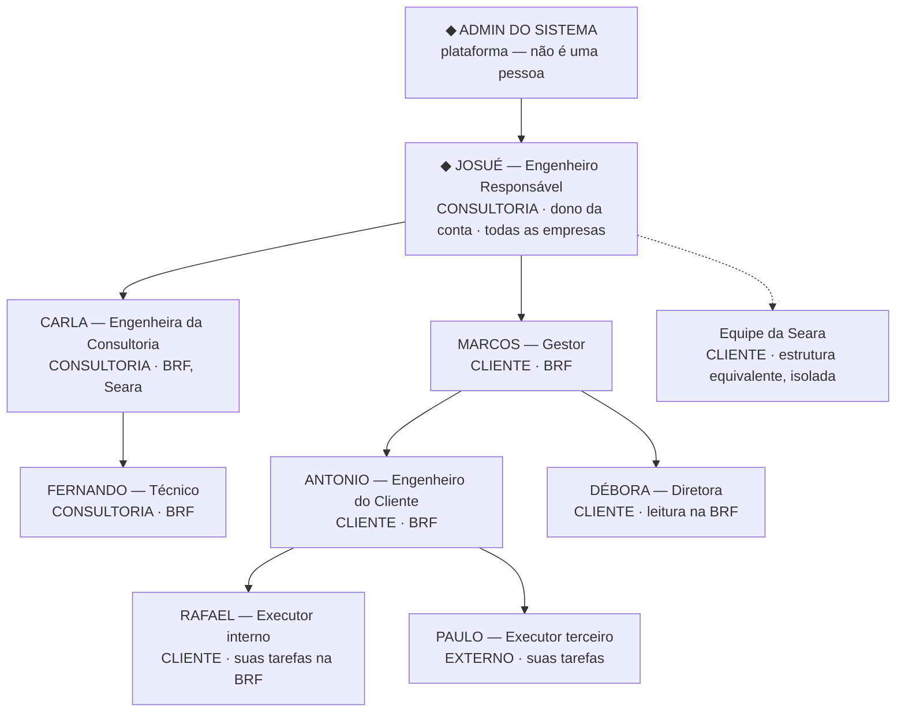

# 01 — Papéis, Escopo e Permissões

Este documento define quem são os atores do sistema, como o acesso de cada um nasce e se limita, e o que cada papel pode fazer. É a fonte da verdade para toda decisão de autorização.

---

## 1. Modelo de conta

```
Conta (raiz)
 └── Engenheiro Responsável           ← dono da conta, raiz de tudo
      ├── Empresas (clientes da consultoria)
      └── Usuários (árvore de convites)
```

Toda entidade do sistema — usuário, empresa, equipamento, análise, tarefa, peça — carrega o identificador da **conta raiz**. Esse é o limite absoluto de isolamento de dados: **nada atravessa contas, em nenhuma hipótese.**

---

## 2. O elenco de referência

Para que o conjunto da documentação fale a mesma língua, estas são as pessoas usadas como exemplo. Todo trecho que citar nomes usa este elenco.

**O cenário:** a **Normatiza** (consultoria do Josué) atende duas empresas clientes — **BRF** e **Seara**. Cada uma tem a própria equipe, o próprio inventário e o próprio plano de ação. O elenco abaixo é o da BRF; a Seara tem gente equivalente.

### Lado consultoria — quem faz a análise

*Escopo pode abranger várias empresas: é uma carteira de clientes.*

| Nome | Papel | Escopo | O que faz na prática |
| :--- | :--- | :--- | :--- |
| **Josué** | Engenheiro Responsável | Todas | Dono da conta. Vende o serviço, cadastra a empresa cliente, faz análise, valida a adequação no final e assina o laudo. É o único que enxerga a operação inteira. |
| **Carla** | Engenheira da Consultoria | BRF, Seara | Engenheira da equipe do Josué. Faz e conclui as análises das empresas que ele atribuiu a ela, valida evidências e emite laudo — mas só nessas empresas. |
| **Fernando** | Técnico | BRF | Vai a campo. Mede a máquina, preenche a ficha técnica, fotografa, levanta os pontos de risco e preenche PAP e PE. **Não conclui a análise** — entrega o levantamento para a Carla fechar. |

### Lado cliente — quem executa a adequação

> **Escopo é sempre uma única empresa.** Ninguém do lado cliente enxerga outra empresa.

| Nome | Papel | Escopo | O que faz na prática |
| :--- | :--- | :--- | :--- |
| **Marcos** | Gestor | BRF | Funcionário da BRF — gerente industrial ou coordenador de SST. Recebe os planos de ação e **aprova orçamento e prazo**. É quem responde pela BRF perante a consultoria e administra a equipe da BRF no sistema. |
| **Antonio** | Engenheiro do Cliente | BRF | Engenheiro de segurança da BRF. Pega a análise pronta e a transforma em obra: define quem faz, quando e quanto custa, aciona a equipe e entrega a evidência. **Nunca toca na análise.** |
| **Débora** | Diretora | BRF | Diretoria industrial da BRF. Não opera nada — acompanha o grau de adequação, o investimento e baixa os laudos. |
| **Rafael** | Executor interno | Suas tarefas | Eletricista da manutenção da BRF. Recebe as tarefas designadas a ele, executa e sobe a foto do que fez. |

### Externo

| Nome | Papel | Escopo | O que faz na prática |
| :--- | :--- | :--- | :--- |
| **Paulo** (Metalúrgica Ipê) | Executor terceiro | Suas tarefas | Empresa contratada pela BRF para fabricar e instalar as proteções físicas. Mesma visão do Rafael: só as tarefas dele. A diferença é contratual, não de sistema. |

> **Numa empresa pequena, Marcos e Antonio são a mesma pessoa.** O engenheiro de segurança que monta o orçamento é o mesmo que o aprova. O sistema permite isso — ver "Acúmulo de papéis" na §5. O elenco acima é o cenário de uma indústria grande, onde as funções estão separadas.

---

## 3. A árvore de convites



**Como ler a árvore:** a seta significa *"criou o acesso de"*. Ela define três coisas —

1. **O teto do escopo.** Ninguém recebe mais do que quem o convidou tem. Como o Marcos só tem a BRF, tudo que nasce abaixo dele vive dentro da BRF.
2. **A fronteira do lado cliente.** A carteira de várias empresas existe **apenas do lado consultoria**. A Carla atende BRF e Seara porque essa é a carteira dela; o Marcos vê só a BRF porque ele *é* da BRF. A equipe da Seara é uma ramificação inteiramente separada, que não se comunica com a da BRF.
3. **A propriedade dos dados.** Tudo o que qualquer um deles cria pertence à conta do Josué, que é a raiz — mesmo quando quem literalmente aperta o botão é o Marcos ou o Antonio. Quem executou a ação não altera a quem os dados pertencem.

### Quem convida quem

| Quem convida | Pode convidar |
| :--- | :--- |
| Josué (Eng. Responsável) | Qualquer papel — é ele quem faz o onboarding do cliente |
| Carla (Eng. da Consultoria) | Técnico |
| Marcos (Gestor) | Engenheiro do Cliente, Diretor, Executor |
| Antonio (Eng. do Cliente) | Executor |
| Fernando, Débora, Rafael, Paulo | Ninguém — a cascata termina neles |

---

## 4. Os oito papéis

Cada papel pertence explicitamente a um **lado** da operação. O lado não é um atributo escondido do usuário — está no próprio papel, e é o que separa quem produz a análise de quem a executa.

| Papel | Lado | Escopo | Convida |
| :--- | :--- | :--- | :--- |
| Admin do Sistema | Plataforma | Global | — |
| Engenheiro Responsável | Consultoria | Todas as empresas da conta | Todos |
| Engenheiro da Consultoria | Consultoria | **Várias** empresas (carteira) | Técnico |
| Técnico | Consultoria | **Várias** empresas (carteira) | — |
| Gestor | Cliente | **Uma empresa** | Eng. do Cliente, Diretor, Executor |
| Engenheiro do Cliente | Cliente | **Uma empresa** | Executor |
| Diretor | Cliente | **Uma empresa** (leitura) | — |
| Executor | Cliente / Externo | Apenas suas tarefas | — |

> **A regra de escopo mais importante do sistema:** múltiplas empresas existem **só do lado consultoria**. Todo papel do lado cliente pertence a uma única empresa. É o que garante que a BRF nunca enxergue nada da Seara.

---

### Admin do Sistema — plataforma
Não é uma pessoa dentro da operação do cliente: é a plataforma. Gerencia contas e catálogos globais. Vive num backoffice separado (Contexto 0).

> **Não é um papel de vínculo**, e por isso não aparece na matriz de permissões abaixo — ela é sempre "…nesta empresa". O acesso é uma dimensão **sobreposta** ao login normal: quem é dono da plataforma e Engenheiro Responsável da própria consultoria tem **um** login, e transita entre os dois pelo menu. É concedido por linha de comando ou por outro admin, nunca por convite — o convite é a porta do produto, e a plataforma não é uma consultoria.
>
> **O admin não enxerga dado de cliente.** O isolamento de conta vale para ele como para qualquer outro; para olhar dentro de uma consultoria ele usa a impersonação auditada (§2.1 de [03](./03_navegacao_e_telas.md)), que grava quem acessou como quem. E ele **não define a senha de ninguém** — dispara a redefinição, e a pessoa escolhe a própria. Poder escolher a senha de um engenheiro seria poder emitir laudo assinado com o CREA dele.

### Engenheiro Responsável — consultoria · Josué
Dono da conta e responsável técnico final. **Também atua operacionalmente**: cadastra empresas e equipamentos, faz análise de risco, valida evidências, assina laudo. Escopo: todas as empresas da conta.
Convida qualquer papel, inclusive os do lado cliente — é ele quem faz o onboarding do cliente.

### Engenheiro da Consultoria — consultoria · Carla
Engenheira da equipe ou parceira. Faz análises de risco, **conclui** análises, valida evidências entregues pelo cliente, define HRN residual e emite laudos — nas empresas do escopo que recebeu do Josué.
Convida: Técnico, dentro do próprio escopo.

### Técnico — consultoria · Fernando
Trabalho de campo: preenche fichas técnicas, levanta pontos de risco, preenche PAP e PE, tira fotos, anexa documentos. **Não conclui análise nem emite laudo** — o ato de congelar a análise é do engenheiro.
Não convida ninguém.

---

### Gestor — cliente · Marcos
**Funcionário da empresa cliente, não da consultoria.** É quem responde pela BRF perante a Normatiza — tipicamente o gerente industrial, o coordenador de SST ou o responsável pela verba de segurança.

**Sua razão de existir: a autoridade de aprovar orçamento e prazo.** Quem decide se a BRF vai gastar R$ 40 mil adequando uma prensa é a BRF, não o Josué. É a única aprovação do sistema.

Além disso, é o administrador do lado cliente: convida Engenheiro do Cliente, Diretor e Executor, e mantém a tabela de preços da empresa.
**Escopo: uma empresa.**

> **Toda empresa precisa ter pelo menos um Gestor.** Não existe empresa ativa sem gestor — é ele quem recebe o plano de ação e aprova. A regra é validada no cadastro da empresa e no desligamento: não se remove o último gestor de uma empresa sem indicar o sucessor.

### Engenheiro do Cliente — cliente · Antonio
O personagem central da fase de execução, e o papel que mais cresceu em relação ao sistema atual. Engenheiro de segurança **da própria empresa cliente**. Recebe a análise pronta e **gerencia a adequação**: define responsável, prazo e orçamento de cada ponto, aciona equipe interna ou terceiro, acompanha a obra e entrega a evidência.

**Nunca** cria ou edita análise, ponto de risco, HRN ou norma descumprida. **Nunca** emite laudo. **Não aprova o próprio orçamento** — quem aprova é o Gestor.
**Escopo: uma empresa.** Convida: Executor.

> **A diferença entre Gestor e Engenheiro do Cliente é a alçada, não o escopo.** Os dois vivem dentro da mesma empresa; um decide se gasta, o outro decide como faz. Em empresa pequena são a mesma pessoa (§5).

### Diretor — cliente · Débora
Perfil de **leitura pura**. É o diretor industrial ou o responsável de SST que precisa acompanhar sem operar: dashboards, grau de adequação, evolução, custos e download dos laudos finalizados. Não move nada, não aprova nada, não cadastra nada.
**Escopo: uma empresa.**
É o destino natural dos usuários `Customer` do sistema legado na migração.

### Executor — cliente ou externo · Rafael (interno) e Paulo (terceiro)
Quem põe a mão na máquina. Um único papel com **dois tipos**:

- **Interno** — funcionário da própria empresa. É o Rafael, eletricista da manutenção da BRF.
- **Terceiro** — empresa ou profissional contratado para a obra. É o Paulo, da Metalúrgica Ipê.

Recebe login com o **menor escopo do sistema**: enxerga apenas as tarefas designadas a ele. Vê o equipamento, o local do ponto e a solução sugerida; registra andamento e finaliza com evidência.

**Não vê:** a análise, o HRN, os demais pontos da máquina, outras máquinas, nem valores além dos da própria tarefa.

**Todo executor tem conta**, inclusive o terceiro. Não existe acesso anônimo por link: a evidência é prova, e prova precisa de autoria atribuível — "Paulo instalou a proteção em 12/03" só se sustenta com identidade autenticada.

O atrito de cadastro é resolvido pelo fluxo, não pela exceção: **quem cria o acesso é alguém da empresa** (o Gestor ou o Engenheiro do Cliente), e o executor apenas define a senha pelo link do convite — ele nunca preenche formulário de cadastro.

Um executor pode atender **várias empresas** da mesma conta com um login só (§5).

> Este papel unifica o "terceiro contratado" e o "envolvido adicional" — o mecânico e o eletricista acionados para a mesma obra. A diferença entre eles é o tipo, não o papel.

---

## 5. Regras de escopo

**Delegação decrescente.** Quem convida só concede um subconjunto do próprio escopo. Validação obrigatória **no servidor**, no ato do convite — a interface não é a defesa.

**Carteira só do lado consultoria.** Papéis da consultoria podem ter várias empresas; papéis do cliente **cujo escopo é a empresa** — Gestor, Engenheiro do Cliente e Diretor — têm exatamente uma. Quando o Josué convida um Gestor, ele escolhe **a** empresa daquela pessoa, não uma lista.

**O Executor é a exceção, e não por privilégio.** O escopo dele não é a empresa: são as próprias tarefas. Ele nunca enxerga a análise, o HRN, as demais máquinas ou qualquer dado no nível da empresa — logo, atender BRF e Seara não lhe dá acesso a nada que ele já não tivesse. Um mesmo instalador terceiro pode ter **vários vínculos ativos**, e vê numa lista só as tarefas de todas as empresas que atende.

**A identidade pertence a uma conta.** Todos os vínculos de um usuário vivem dentro da mesma conta. Um executor terceiro que atenda clientes de **duas consultorias diferentes** terá dois logins, um por conta — é o preço de "nada atravessa contas, em nenhuma hipótese". Dentro de uma mesma consultoria, um login basta, por mais empresas que ele atenda.

**Acúmulo de papéis.** Um mesmo usuário pode ter **mais de um papel na mesma empresa**. O caso concreto e esperado:

| Cliente | Como fica |
| :--- | :--- |
| **Indústria grande** (BRF) | Marcos é Gestor, Antonio é Engenheiro do Cliente. Duas pessoas, alçadas separadas: um aprova, o outro executa. |
| **Empresa pequena** | Uma pessoa só, com os dois papéis. Monta o orçamento como Engenheiro do Cliente e aprova como Gestor. |

Isso resolve o cliente pequeno sem inventar exceção no fluxo: a etapa de aprovação continua existindo, o registro de "aprovado por Fulano" continua sendo gerado, e o histórico mostra que quem aprovou foi quem orçou. **Não há trava — apenas rastro.**

> **Consequência para a modelagem:** o vínculo de um usuário com uma empresa carrega **um ou mais papéis**, não um só. A permissão efetiva é a união dos papéis daquele vínculo. Ver a entidade `Membership` em [04 — Modelo de Dados](./04_modelo_de_dados.md).

**Herança de conta.** Todo usuário convidado em qualquer nível pertence à conta raiz. Quem "aperta o botão convidar" é irrelevante para efeito de propriedade dos dados. Isso importa na cobrança: **a conta é a unidade de faturamento, não o usuário.**

**Onboarding assistido.** O fluxo primário é o convite feito pela consultoria, que entrega tudo pronto — todo o cadastro é feito pela consultoria e entregue pronto ao cliente, para não depender de ele fazer errado. Auto-cadastro, se existir, é caminho secundário para novas consultorias.

**Revogação exige sucessão.** Não existe "desativar usuário" seco. Ao remover o acesso de alguém que tem subordinados, escopo ou tarefas, o sistema **obriga a escolha de um sucessor** que herda:
- os usuários que estavam abaixo dele na árvore;
- as empresas do seu escopo;
- as tarefas em que ele figurava como responsável.

Nada fica órfão. O fluxo dessa tela está em [03 — Navegação e Telas](./03_navegacao_e_telas.md).

---

## 6. Autorização bidimensional

Perguntar apenas "este papel pode editar o plano de ação?" é insuficiente. A permissão efetiva é a interseção de duas dimensões:

```
PODE?  =  papel do usuário no vínculo com a empresa
          ×
          etapa atual do item sobre o qual ele quer agir
```

Exemplo concreto: o Engenheiro do Cliente **pode** editar orçamento — mas apenas enquanto o ponto estiver na etapa 2 (*Estudando adequação*). Assim que o orçamento é aprovado pelo Gestor, o mesmo usuário com o mesmo papel perde a permissão sobre o mesmo campo, porque o orçamento aprovado é congelado.

A tabela de quem age em cada etapa está em [02 — Ciclo de Adequação](./02_ciclo_de_adequacao.md). **As duas tabelas precisam ser lidas em conjunto** — a matriz abaixo diz o que o papel pode fazer *em princípio*; a máquina de estados diz *quando*.

---

## 7. Matriz de permissões

**Legenda:** ● total · ◐ parcial ou limitado ao escopo · ○ somente leitura · — sem acesso

| | Plataforma | Consultoria | | | Cliente | | | Externo |
| :--- | :-: | :-: | :-: | :-: | :-: | :-: | :-: | :-: |
| **Recurso** | **Admin** | **Eng. Resp.** | **Eng. Cons.** | **Técnico** | **Gestor** | **Eng. Cliente** | **Diretor** | **Executor** |
| Contas e catálogos globais | ● | — | — | — | — | — | — | — |
| Cadastro de empresas | ○ | ● | ◐ | — | — | — | — | — |
| Convidar usuários | — | ● | ◐ | — | ◐ | ◐ | — | — |
| Desligar com sucessão | ● | ● | — | — | ◐ | — | — | — |
| Personalização de laudos | — | ● | — | — | — | — | — | — |
| Cadastro de equipamentos | ○ | ● | ● | ● | ● | ● | ○ | — |
| **Criar/editar análise** | ○ | ● | ● | ● | — | — | — | — |
| **Concluir análise (congelar)** | — | ● | ● | — | — | — | — | — |
| Ver análise concluída | ○ | ● | ● | ○ | ○ | ○ | ○ | — |
| Tabela de preços da empresa | ○ | ● | ○ | — | ● | ● | ○ | — |
| Definir responsável/prazo/orçamento | — | ○ | ○ | — | ● | ● | — | — |
| **Aprovar orçamento** | — | — | — | — | ● | — | — | — |
| Executar e registrar evidência | — | — | — | — | ● | ● | — | ◐ |
| **Validar/reprovar evidência** | — | ● | ● | — | — | — | — | — |
| **Definir HRN residual** | — | ● | ● | — | — | — | — | — |
| Emitir laudos | — | ● | ● | — | — | — | — | — |
| Baixar laudos | ○ | ● | ● | ○ | ● | ● | ● | — |
| Relatórios gerenciais | ○ | ● | ◐ | — | ◐ | ◐ | ○ | — |
| Histórico e auditoria | ● | ● | ◐ | ◐ | ◐ | ◐ | ○ | — |

**Papéis acumulados:** quando um usuário tem mais de um papel na mesma empresa (§5), a permissão efetiva é a **união das colunas**. Numa empresa pequena, a mesma pessoa soma as colunas Gestor e Engenheiro do Cliente — passa a poder orçar *e* aprovar.

### As três linhas que definem o sistema

- **Criar/editar análise** é exclusivo do lado consultoria. Nenhum papel do cliente aparece nessa linha — é a garantia técnica da imutabilidade da apreciação de riscos.
- **Aprovar orçamento é exclusivo do Gestor.** Sempre alguém **da empresa cliente**, porque quem decide gastar é quem arca com a obra. Nenhum papel da consultoria — nem o Engenheiro Responsável — aprova verba de cliente. O Engenheiro do Cliente monta o orçamento, mas não o aprova; salvo quando as duas funções recaem sobre a mesma pessoa por acúmulo de papéis.
- **Validar evidência, HRN residual e emitir laudo** voltam para a consultoria. É o fechamento do ciclo.
