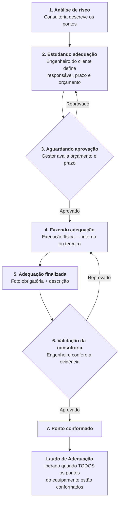

# 02 — O Ciclo de Adequação

Este é o núcleo do sistema. O plano de ação **não é um quadro de arrastar livre**: é uma máquina de estados em que cada transição tem um dono, uma permissão e um registro.

---

## 1. A máquina de estados

---

## 2. Etapa por etapa

| # | Etapa | Quem age | O que acontece | Como sai |
| :-: | :--- | :--- | :--- | :--- |
| 1 | **Análise de risco** | Técnico + Engenheiro da Consultoria | Ponto de risco identificado com HRN acima do aceitável. Descrição do perigo, foto, normas descumpridas e **solução sugerida**. | Ao concluir a análise, cada ponto acima do limite gera automaticamente uma tarefa no plano de ação. |
| 2 | **Estudando adequação** | Engenheiro do Cliente | Define **responsável** (executor interno ou terceiro), **prazo**, e monta o **orçamento** puxando ou cadastrando itens da tabela de preços da empresa. | Envia para aprovação. |
| 3 | **Aguardando aprovação** | **Gestor** | Avalia orçamento e cronograma. Pode **aprovar** ou **reprovar com justificativa**. | Aprovado → segue. Reprovado → volta para a etapa 2 com o motivo registrado. |
| 4 | **Fazendo adequação** | Executor (interno ou terceiro) | Instalação física dos itens. | Executor marca como finalizado, anexando evidência. |
| 5 | **Adequação finalizada** | Executor / Engenheiro do Cliente | **Foto obrigatória** do ponto adequado **+ descrição textual** do que foi feito. Ambos obrigatórios. | Vai para validação da consultoria. |
| 6 | **Validação da consultoria** | Engenheiro da Consultoria | Confere se a evidência comprova a adequação. Pode **reprovar o ponto individualmente**, com justificativa, exigindo refação. | Aprovado → ponto conformado. Reprovado → volta para etapa 4. |
| 7 | **Ponto conformado** | Engenheiro da Consultoria | Estado final do ponto. A consultoria registra o **HRN residual**. | — |

> **O fluxo atravessa as duas organizações duas vezes.** Sai da consultoria na etapa 1, vive no cliente das etapas 2 a 5, e volta para a consultoria na 6. Cada travessia é um *handoff* que precisa de notificação — é onde o processo trava na vida real. Ver [05 — Regras Transversais](./05_regras_transversais.md).

---

## 3. Tabela de transições

Esta tabela é a fonte da verdade para a implementação da autorização bidimensional descrita em [01 — Papéis e Permissões](./01_papeis_e_permissoes.md).

| De | Para | Quem pode disparar | Exige |
| :--- | :--- | :--- | :--- |
| — | 1. Análise de risco | Sistema, ao concluir a análise | Ponto com HRN acima do aceitável |
| 1 | 2. Estudando adequação | Sistema, ao concluir a análise | Análise congelada |
| 2 | 3. Aguardando aprovação | Engenheiro do Cliente | Responsável, prazo e orçamento preenchidos |
| 3 | 2. Estudando adequação | Gestor | Justificativa de reprovação |
| 3 | 4. Fazendo adequação | Gestor | Registro de quem aprovou e quando; orçamento é congelado |
| 4 | 5. Adequação finalizada | Executor / Engenheiro do Cliente | Foto **e** descrição do que foi feito |
| 5 | 6. Validação da consultoria | Sistema, automático | — |
| 6 | 4. Fazendo adequação | Engenheiro da Consultoria / Responsável | Justificativa de reprovação |
| 6 | 7. Ponto conformado | Engenheiro da Consultoria / Responsável | HRN residual preenchido |

Toda transição registra **quem, quando, de onde para onde e por quê**, e o registro nunca é sobrescrito.

---

## 4. Regras derivadas

### A unidade de trabalho é o PONTO; o portão do laudo é o EQUIPAMENTO
Cada ponto de risco anda no seu próprio ritmo. O **Laudo de Adequação só é liberado quando todos os pontos daquele equipamento estiverem conformados.** Uma máquina cujo único problema é um botão de emergência faltando percorre o fluxo inteiro sozinha.

### O limite: só risco acima do aceitável entra no ciclo
O corte é a faixa de classificação do HRN. **`HRN ≤ 1,0` é Risco Aceitável** — não exige medida de engenharia, não gera tarefa e não entra no plano de ação. Todo ponto acima disso gera um `ActionItem` ao concluir a análise.

**Consequência para o portão do laudo:** o portão conta os **itens do plano de ação**, não os pontos da análise. Como só entra no plano o que precisa ser conformado, não existe ponto que trave o portão sem ter o que corrigir — o conjunto de pontos que precisam conformar é exatamente o conjunto que gerou tarefa.

Um equipamento com 5 pontos, sendo 2 aceitáveis e 3 acima do limite, libera o Laudo de Adequação quando os **3** conformarem. A barra de progresso mostra 3 como denominador.

> Os pontos aceitáveis continuam existindo e aparecem no **Laudo de Apreciação de Riscos** como pontos mapeados e avaliados — a avaliação registrou que eles foram analisados e considerados aceitáveis. Eles apenas não figuram no Laudo de Adequação, porque não houve adequação a comprovar.

### Evidência é foto + texto, sempre
A foto sozinha não explica o que foi feito; o texto sozinho não prova nada. Os dois são obrigatórios para fechar a etapa 5.

### Reprovação é sempre justificada e sempre volta um passo
Tanto a reprovação do Gestor (3 → 2) quanto a da consultoria (6 → 4) exigem justificativa escrita, ficam no histórico do ponto e notificam o responsável. **O ponto acumula suas reprovações — o histórico não é sobrescrito.**

### HRN residual é da consultoria
Quem atribui o novo valor de risco após a adequação é sempre o engenheiro da consultoria, nas etapas 6/7. **O cliente nunca calcula HRN.**

### Sempre existe quem aprovar, e quem aprova é a empresa
Toda empresa tem obrigatoriamente ao menos um Gestor, então a etapa 3 nunca fica sem dono. E a aprovação é sempre **do lado cliente**: quem decide se vai gastar o dinheiro é a empresa, não a consultoria. A consultoria dá o caminho; a empresa decide se executa.

Em empresa pequena, o Gestor e o Engenheiro do Cliente são a mesma pessoa — ela monta o orçamento e aprova em seguida. A etapa continua existindo, gera o registro de "aprovado por", e o histórico deixa claro que quem aprovou foi quem orçou. Sem trava, com rastro.

### Orçamento aprovado é congelado
Uma vez aprovado na etapa 3, o orçamento não é editável. Alteração de escopo da obra exige reprovar e voltar à etapa 2, ou registrar um aditivo versionado — nunca edição silenciosa do valor que o Gestor aprovou.

### Prazo é compromisso
Com o prazo definido pelo cliente e aprovado pelo Gestor, atraso vira indicador: alerta ao responsável, destaque no dashboard e contagem nos relatórios gerenciais.

### Notificação de handoff
Quando o último ponto de um equipamento é conformado, a consultoria é notificada — é o gatilho do trabalho dela. Da mesma forma, o cliente é notificado quando uma análise é concluída e um novo plano de ação nasce.

---

## 5. O que gera uma tarefa

A regra definida é: **um ponto de risco com HRN acima do limite aceitável (`> 1,0`) gera uma tarefa** ao concluir a análise. Ponto em faixa `ACCEPTABLE` não gera nada.

> **⏳ Decisão pendente — origem das tarefas.**
> A análise produz três tipos de apontamento: pontos de risco (HRN), não conformidades de **PAP** e não conformidades de **PE**. Só o primeiro está definido como gerador de tarefa. Ainda não está decidido se PAP e PE também geram itens no plano de ação, e como isso se relaciona com o portão do Laudo de Adequação.
>
> Detalhamento e impacto em [06 — Pendências](./06_pendencias.md).
